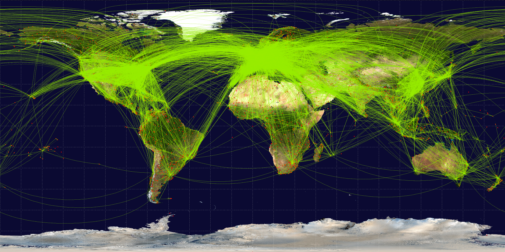

Airtraffic
==============================

forecast air traffic


Project description
------------


The objective of the code is therefore to forecast air traffic according to the base airport and the destination airport. To do this, we will use the Prophet model developed by facebook (link to documentation: https://facebook.github.io/prophet/) and also the Nixtla models (https://www.nixtla.io/).
The prediction results will be displayed on the streamlit application according to the model chosen.

Environment
------------

1. Create your virtual environment:
```conda create --name airtraffic```
2. Activatz your virtual environment:
```conda activate airtraffic```
3. Install Cookiecutter and streamlit with anaconda prompt:
```pip install Cookiecutter streamlit```

Repo
------------

Use Cookiecutter to clone folders

Launch the streamlit application  
------------
1. Use with anaconda prompt:
```streamlit run app.py ```
2. To use the application please select the origin and destination airports.
Some airports do not serve other airports, so here is a list of airports that contain data:
LGW-AMS
LGW-BCN
LYS-OPO 
LYS-ORY

3.Then select the date and the number of days you want to predict. The result is in red and you can see the different evaluations of the model

Modification
------------

you can modify the source code of app.py using local software

Streamlit app
------------
https://tugcinar-airtraffic-srcapp-1375i1.streamlit.app/


<p><small>Project based on the <a target="_blank" href="http://git.equancy.io/tools/cookiecutter-data-science-project/">cookiecutter data science project template</a>. #cookiecutterdatascience</small></p>
